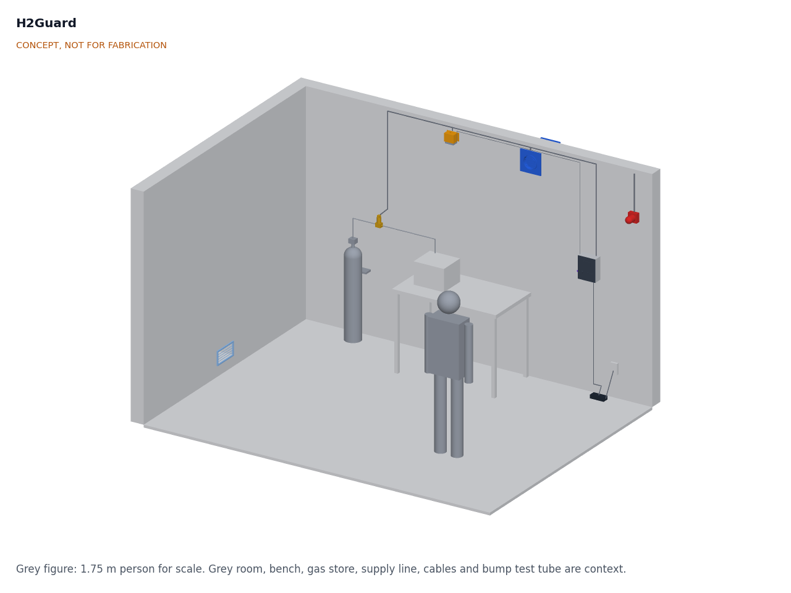
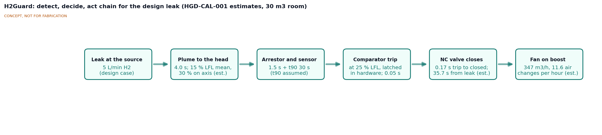
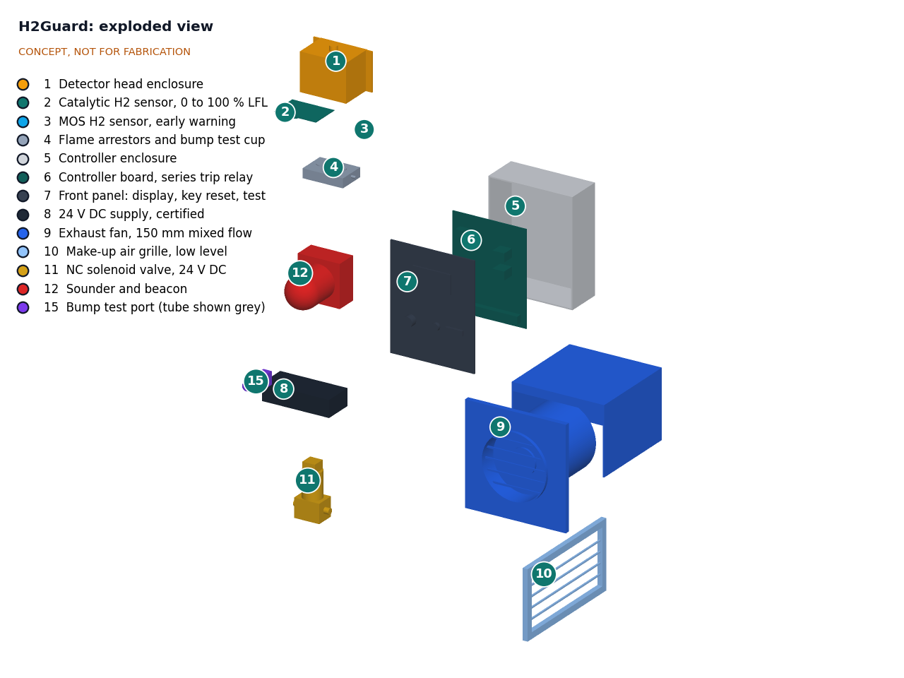
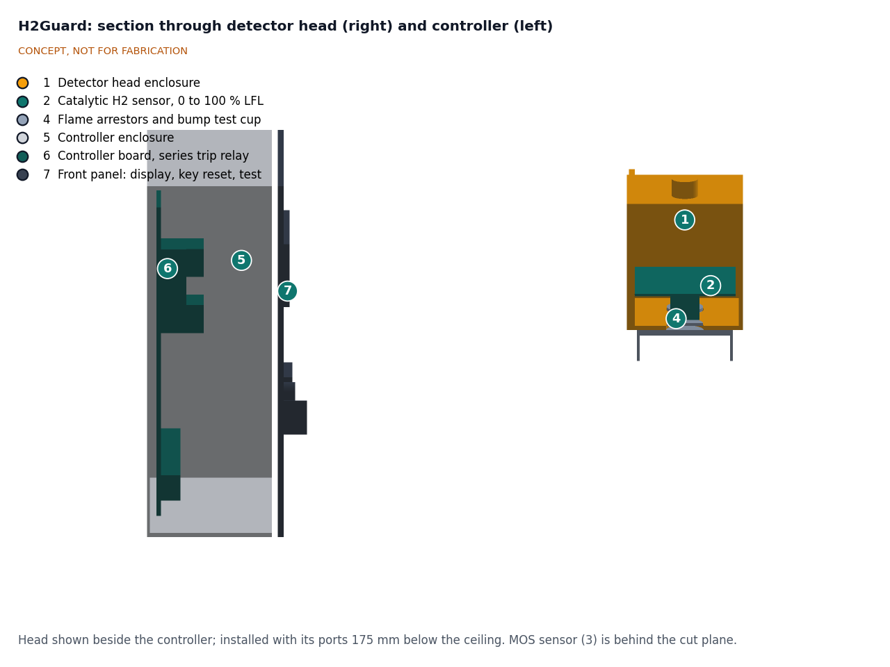

# H2Guard design precis

H2Guard protects one small room where hydrogen is used. A detector head at the ceiling carries a catalytic sensor that reads 0 to 100 % of the lower flammability limit (LFL) and a metal oxide sensor for early warning. A wall controller at chest height keeps a 150 mm exhaust fan running at high level, holds a normally closed solenoid valve on the hydrogen supply open only while all is well, and drives a sounder and beacon. At 10 % LFL it warns and boosts the fan; at 25 % LFL it closes the valve and latches the alarm. Loss of power, a sensor fault, a stopped fan or a crashed controller all close the valve, and a hardware comparator opens a relay in series with the valve without the firmware. The TRL 3 calculations (HGD-CAL-001) give 35.7 s from a leak to the valve closing with an assumed 30 s sensor t90, about 5 % LFL in the 30 m3 room for the 5 L/min design leak with the fan running, and a parts cost of $264 against a $180 budget. H2Guard is a research and teaching prototype, not a certified gas detection system.

*Figure 1. H2Guard in the 30 m3 reference room, with a 1.75 m person for scale. Detector head (orange) above the bench apparatus, exhaust fan (blue) high on the back wall, make-up air grille low on the far side wall, solenoid valve (gold) on the supply line, controller with its bump test port, and beacon near the door. Grey parts are context. Built from the parametric model.*

## How it works

1. **Sense.** Hydrogen rises from a leak as a buoyant plume and spreads under the ceiling. The detector head sits directly above the likely leak source, with its sensor ports 175 mm below the ceiling. The catalytic sensor measures 0 to 100 % LFL and sets the warning and trip. The metal oxide sensor responds from about 30 ppm and shows small, slow leaks as a trend long before the catalytic reading moves; it never trips the system alone, because humidity and other vapors affect it. Each sensor sits about 2 mm behind a 2 mm sintered arrestor disc, which adds about 1.5 s of lag.
2. **Decide.** The controller reads both sensors. The microcontroller handles set points, display, logging and self-test, and switches the valve through a MOSFET. In parallel, a hardware window comparator watches the catalytic sensor bridge: above the trip level, or if the bridge reads open or shorted, it sets a hardware latch that opens a relay in series with that MOSFET. Either switch opening closes the valve, and only the key resets the latch.
3. **Act.**
   - **Normal:** fan at continuous speed, valve energized (open), green light.
   - **Warning, 10 % LFL (0.4 % vol):** fan to boost, amber light, intermittent sounder. Clears itself when the reading falls.
   - **Trip, 25 % LFL (1.0 % vol):** valve de-energized (closed), fan on boost, continuous sounder and red beacon. Latched: the supply stays closed until someone turns the reset key and the reading is below 10 % LFL.
   - **Fault:** any loss of 24 V power, sensor fault, heater failure, watchdog timeout (1 s) or fan stop (no tachometer pulses for 10 s) closes the valve and shows the fault.
4. **Ventilate.** The fan runs all the time, so it is never switched on in a flammable mixture, and so no gas can flow unless the room is being ventilated. Make-up air enters through a low grille on the far side of the room, sweeping the room toward the high exhaust.
5. **Record and test.** The controller logs readings, warnings, trips, faults and resets. A test button runs the sounder, beacon, fan boost and valve close. For a bump test, certified 1 % vol hydrogen span gas is connected to a capped port beside the controller; a 4 mm tube carries it up the cable route to a nozzle in the drip skirt under the head, which acts as a test cup. The reading settles in about 67 s. Because 1 % vol is the trip level, a full-span bump test also trips the system and proves the chain.

*Figure 2. Detect, decide and act chain for the design leak in the 30 m3 reference room, with values from HGD-CAL-001. They are estimates; the sensor t90 is an assumption not yet confirmed from a datasheet.*

## Main components

Table 1. Main components. Numbers match `bom/bom.csv`, Figure 3 and drawing HGD-DWG-001.

| # | Component | Choice | Notes |
| --- | --- | --- | --- |
| 1 | Detector head enclosure | ABS or polycarbonate box 110 x 80 x 90 mm, two 26 mm sensor ports facing down | Directly above the source, ports 175 mm below the ceiling |
| 2 | Catalytic hydrogen sensor | Catalytic (pellistor) sensor with hydrogen response, 0 to 100 % LFL, for example Figaro TGS6812 | Primary trip sensor; needs oxygen and can be poisoned by silicones |
| 3 | Metal oxide hydrogen sensor | About 30 to 3,000 ppm, for example Figaro TGS2616-C00 | Early warning and trend only |
| 4 | Flame arrestor discs and bump test cup | Sintered stainless discs 25 x 2 mm, pores 50 µm or less; drip skirt 96 x 66 x 22 mm forming the test cup | Not a certified flameproof assembly |
| 5 | Controller enclosure | IP65 polycarbonate wall box 200 x 250 x 90 mm | Top 1,025 mm below the ceiling |
| 6 | Controller board | RP2040-class microcontroller with 4 MB flash; comparator with hardware latch and series relay; drivers for valve, fan and alarm; tachometer input; event log | Firmware beyond a labeled sketch is TRL 4 work |
| 7 | Front panel | OLED display, key-switch reset, test button, status lights | The key keeps students from clearing a trip |
| 8 | 24 V DC power supply | Certified plug-in supply, 24 V, 60 W | Only mains part; bought certified |
| 9 | Exhaust fan | 150 mm mixed-flow EC duct fan, 24 V, about 450 m3/h free air, 200 Pa shut-off, tachometer; grille, sleeve, backdraft shutter, weather hood | Re-specified at TRL 3; runs continuously at about 43 % speed |
| 10 | Make-up air grille | Low-level wall grille 300 x 160 mm with insect mesh | Far side of the room from the fan |
| 11 | Normally closed solenoid valve | 1/4 in, direct acting, brass, FKM seals, 24 V DC, 0 to 10 bar, Zener clamp | After the regulator; closes on loss of power |
| 12 | Sounder and beacon | 24 V, about 90 dB at 1 m, red flashing | By the door, top 450 mm below the ceiling |
| 15 | Bump test port and tube | Capped push-fit port beside the controller, about 3 m of 4 mm tube to the cup nozzle | New at TRL 3 for R12 |

*Figure 3. Exploded view of the H2Guard parts with BOM numbers. Cabling (BOM line 13) and fixings (line 14) are not shown.*

*Figure 4. Sections through the controller (left) and the detector head (right), each cut on a vertical plane and seen from the side. The head section passes through the catalytic sensor, its arrestor disc and the bump test cup. The head is drawn beside the controller for this view.*

The general arrangement drawing [HGD-DWG-001](../cad/drawings/HGD-DWG-001.pdf) (Rev P1) gives the mounting heights and main dimensions from the parametric model `cad/src/model.py`. The blueprint concept sheet ([PDF](../media/concept-blueprint.pdf)) and the [interactive 3D model](../media/viewer.html) show the parts in place.

## Key numbers

All values are from HGD-CAL-001, which gives the method and assumptions. They are first-principles estimates.

Table 2. Key numbers for the 30 m3 reference room and the 5 L/min design leak.

| Quantity | Value |
| --- | --- |
| Hydrogen from a 100 W electrolyzer | 0.39 L/min |
| Ceiling layer (0.3 m) to 25 % LFL without ventilation | 7.2 min (whole room mixed: 60 min) |
| Room and upper layer with 150 m3/h exhaust | 5.0 % LFL (2.5 % LFL on boost) |
| Plume at the detector head | About 15 % LFL mean, about 30 % LFL on the plume axis |
| Leak to valve closed | 35.7 s with an assumed 30 s sensor t90; 0.17 s from trip to closed |
| Hydrogen released before closing | 3.0 L, plus 0.47 L in the line downstream |
| Fan delivery against duct losses | 347 m3/h at full speed (the TRL 2 fan gave 237 m3/h) |
| Inventory limit | 300 L at 1 atm (25.1 g); a 0.13 mm orifice at 10 bar gauge limits a failure to 5 L/min |
| Power | 13.1 W normal, 48.3 W warning, 40.3 W trip |
| Bump test | About 67 s; 1.36 L of span gas per test |
| Parts cost | $264.00 (without fan and grille $206) |

Two findings matter for the design. First, the design leak trips the system only if the head is on the plume axis; beside it, the head sees about 15 % LFL and warns without closing the supply, although the room stays at about 5 % LFL. Second, a fan rated at the boost flow in free air cannot deliver it through a real duct, so the fan is re-specified. The review note proposes remedies for the first, awaiting Amish.

## Key design choices

The choices below are adopted as recommended for TRL 3 under Amish's 2026-09-25 instruction, open for his review (HGD-DDR-001).

1. **Catalytic sensor for the trip, metal oxide sensor for early warning** (D1). Options were (a) catalytic plus metal oxide (about $50 of sensors); (b) a certified molecular property spectrometer sensor (about $249, t90 under 20 s, poisoning resistant, [NevadaNano](https://nevadanano.com/mps-hydrogen-gas-sensor/)); (c) metal oxide only. Adopted: (a) for the teaching prototype, with (b) documented as the upgrade for any room used without close supervision.
2. **Normally closed valve, energize to open** (D3). Fail-safe on power loss, at the cost of 8 W of coil power all the time.
3. **Independent hardware trip** (D8). A comparator with its own latch opens a relay in series with the microcontroller's valve switch, so a firmware bug cannot hold the valve open.
4. **Continuous ventilation with a boost** (D4). Avoids switching a motor on in a flammable mixture and proves fan rotation before gas can flow.
5. **Set points 10 % LFL (warn) and 25 % LFL (trip)** (D2). More conservative than the 25 % and 50 % levels often used in industry.
6. **24 V DC throughout, with a certified plug-in supply** (D9).
7. **Key-switch reset** (D6). Stops students from clearing a trip without a supervisor.
8. **One detector head per room** (D6). A second head is an option where the ceiling has beams or pockets, or where leak points are far apart (see Key numbers).

## Relation to other lab projects

- **H2Bench** is the first host. Its README states that it is "Protected by H2Guard", and its gas system (electrolyzer, low-pressure store, regulator and tubing) is where the valve and any flow restrictor go. The inventory rule (R9, D5) applies to H2Bench's storage; its 2 L tank at 300 kPa gauge holds 7.9 L, 2.6 % of the limit. H2Bench's review asks for interlock outputs to cut its power supply and close its tank solenoid; H2Guard has one valve output at present (see the review note).
- H2Guard does not use a SwapCell pack or any lithium cell, and it does not depend on FieldNode, CellGuard, MotionCore, ThermaCart, TwinKit or CalRig.

## Safety

> **Safety:** Hydrogen is flammable in air from about 4 % to 74 % by volume and ignites with very little energy. H2Guard is a research and teaching prototype, not a certified gas detection system, and it must not be the only safeguard in any room where codes or insurers require certified detection. Use certified equipment for any real installation.

> **Safety:** The parts are not certified for hazardous areas. The catalytic sensor element runs hot, and the fan motor, relays and supply are possible ignition sources. The design limits this by keeping the controller and supply low on the wall, running the fan continuously and fitting flame arrestors to the sensor ports, but it does not remove the risk.

> **Safety:** The design leak assumes a flow restrictor. A failed regulator on an unrestricted high-pressure cylinder can release gas far faster than the fan can remove it. Keep inventories within the R9 limit (300 L at atmospheric pressure for the 30 m3 room) or fit a restrictor, and have gas fittings made and leak-tested by a competent person.

> **Safety:** Catalytic sensors need oxygen and can be poisoned by silicones, sulfur compounds and some solvents, which makes them read low without warning. Bump test before each teaching session and after any exposure to these vapors, and replace the sensor when it fails a bump test.

> **Safety:** A blocked duct or a stuck shutter is not detected while the fan still turns, and a leaking valve seat is not detected at all (HGD-CAL-001, Table 4). Check the airflow and the valve at every session until airflow proving and a valve proof test are designed.

> **Safety:** Mains power enters only through a certified plug-in supply. Do not open it or wire mains inside the controller.

## Open questions

- Confirm t90, power and poisoning behavior of the chosen catalytic sensor from its datasheet, and whether its hydrogen output gives 1 % LFL resolution (R1, R4).
- Measure the delivery factor of the open bump test cup and set the pass level.
- How airflow is proven: tachometer only, or a differential pressure switch (HGD-DDR-001, O4). Proposed, awaiting Amish.
- Low-cost solenoid valve or a certified gas valve (O5). Proposed, awaiting Amish.
- Where set points and the inventory rule come from for each country the first users are in (O3); oxygen depletion monitoring (O2). Proposed, awaiting Amish.
- The budget (O1) and the new proposals in the review note (timed escalation from warning to trip, head placement rule, R13 scope). Proposed, awaiting Amish.
