# H2Guard prototype build plan

**Plan, not yet built.** How to build the first proof-of-concept prototype, component by component. Building and testing to it is TRL 4 work. Decisions still to be made are kept in the design decisions register ([docs/06-design-decisions.md](06-design-decisions.md)), not here.

## 1. What you are building

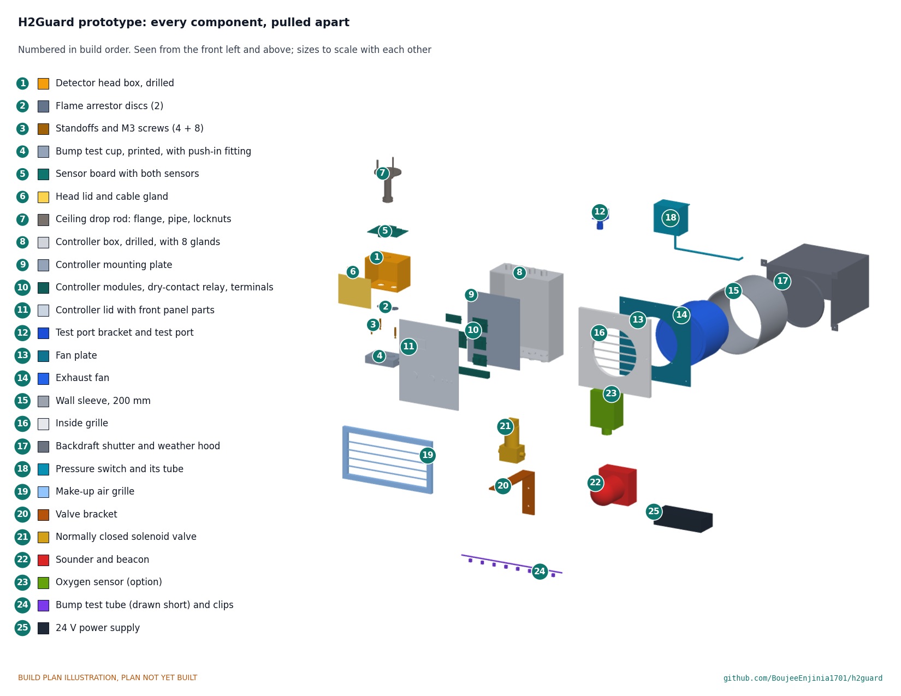

*Figure 1. Every component pulled apart and numbered in build order. The tube (21) is drawn short; it is about 2.7 m long.*

The prototype is one H2Guard installed in a teaching room of about 30 m³ (4 x 3 x 2.5 m): a small detector head on the wall just under the ceiling above the bench apparatus, a controller box at chest height, an exhaust fan high in the back wall, a make-up air grille low on the far side wall, a normally closed solenoid valve on the hydrogen supply, a sounder and beacon by the door, a plug-in 24 V supply, and a thin tube that carries test gas from a port beside the controller up to the head. Figure 1 shows the 22 components in the order you make or fit them. Nine are made or drilled in a small workshop: the head box, the printed bump test cup, the sensor board, the controller box and its lid, the controller mounting plate, the test port bracket, the fan plate and the valve bracket. Everything else is bought and fitted. The work is drilling plastic boxes, cutting and drilling aluminium sheet, angle and flat bar, bending one bar, one 3D print, soldering two sensors to a prototype board and wiring bought modules with screw terminals. The gas connection to the valve is made by a competent gas fitter, and the two wall openings for the fan and the make-up air grille are builder's work. The parts cost about USD 289 from the bill of materials.

> **Safety:** Hydrogen is flammable in air from about 4 % to 74 % by volume and ignites very easily. No hydrogen is used while building; the first gas, a certified 1 % test mixture, comes in only at the safety stops of section 6. H2Guard is a research and teaching prototype, not a certified gas detection system, and must not be the only safeguard in a room where certified detection is required. The 24 V supply is a bought, certified plug-in unit: no mains wiring is part of this build.

## 2. What changed to make it buildable

The concept showed what H2Guard does and where each part goes in the room; some of its parts could not be made, fitted or held as drawn. Each change below keeps what the system does, and all of them are recorded in decision record HGD-DDR-003, open for Amish's review.

*Table 1. Changes from the concept.*

| Component | The concept had | The buildable design has | Why |
| --- | --- | --- | --- |
| Bump test cup | A solid top that covered both sensor ports | Two 22 mm openings over the ports (Figure 3) | Gas can reach the sensors |
| Arrestor discs | 25 mm discs in 26 mm ports, with nothing to hold them | 22 mm ports; each disc rests on the ledge and is bonded round its edge with epoxy (Figure 3) | The disc cannot fall out and gas cannot pass round it |
| Head fixing | A wall plate that cut into the box, and no screws | Two screws through the back of the box into wall plugs; lid on the room side | Uses a stock box as it comes |
| Sensor board and cup | No fixing | Four 22 mm standoffs: screws from below hold the cup, screws from above hold the board (Figure 5) | One set of parts holds both and sets the sensor height |
| Test gas nozzle | A solid stub | A push-in fitting for 4 mm tube in a boss on the cup (Figure 6) | A standard fitting the tube pushes into |
| Controller inside | A board floating in the box | An aluminium mounting plate on the box's four bosses, modules on standoffs (Figure 10) | Bought modules, nothing floating |
| Front panel | A panel floating in front of the box | The box's own lid, cut for the display, key, button and lights (Figure 12) | The lid seals the box with the panel parts in it |
| Cable entries | None | Five cable glands, four on top and one underneath (Figure 8) | Keeps the box sealed |
| Test port | A block overlapping the port | A short aluminium angle on the wall with the port pointing down through it (Figure 14) | Test gas connects from below at chest height |
| Exhaust fan | A 146 mm motor floating in a 150 mm sleeve | The 170 mm fan body in a 200 mm sleeve, held by a fan plate on the inside wall (Figure 16) | The air path is still 150 mm, so the fan's delivery is unchanged |
| Solenoid valve | Hanging on the gas pipe, which passed through it | On a bent flat-bar bracket from the wall (Figure 18) | The gas joints carry no weight |

## 3. Making the components

Make and check each component before the assembly step that needs it. Sizes are in millimetres. "Left" and "right" are as seen standing in the room facing the wall the part is on. Workshop tolerance is 0.5 mm unless a step says otherwise; drawings do not carry tolerances before TRL 4.

### 3.1 Detector head box, drilled

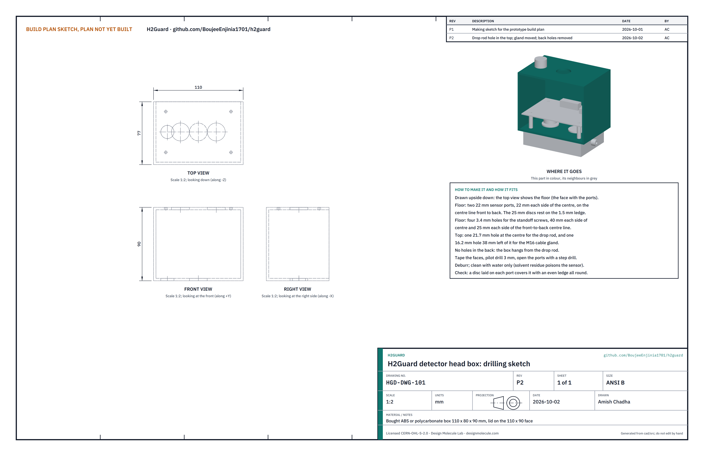

*Figure 2. Detector head box drilling sketch (HGD-DWG-101), drawn upside down so the top view shows the floor.*

**What it is and what it is made from.** The small box at the ceiling that carries both sensors. A bought ABS or polycarbonate box 110 wide, 80 deep and 90 tall, with its lid on one 110 x 90 face; the lid faces into the room.

**How to make it.**

1. Cover the floor, top and back with masking tape and mark the centre lines.
2. Floor: two sensor ports, 22 mm diameter, 22 mm each side of the centre on the centre line front to back. Pilot drill 3 mm at low speed with a block of wood behind, then open with a step drill and light pressure.
3. Floor: four 3.4 mm holes for the standoff screws, 40 mm each side of the centre and 25 mm each side of the front-to-back centre line (80 x 50 mm apart).
4. Top: one 16.2 mm hole at the centre for the cable gland.
5. Back: two 4.4 mm holes 35 mm each side of the centre and 15 mm below the top, for the wall screws.
6. Deburr inside and out. Clean with water only: solvent and flux residue poison the catalytic sensor.

**How it fits the parts next to it.**

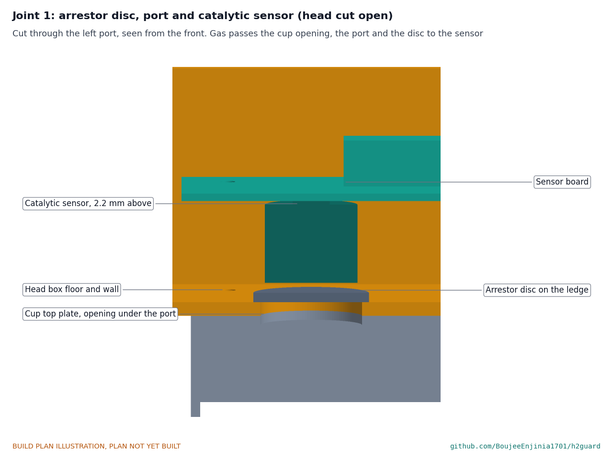

*Figure 3. Cut through the left port. Test gas or a leak passes the opening in the cup, the 22 mm port and the 2 mm sintered disc to the sensor 2.2 mm above it.*

Each 25 mm sintered stainless disc lies on the inside of the floor over its port, resting on the 1.5 mm ledge all round, and is bonded with a bead of two-part epoxy round its edge so no gas can pass round it. Never use silicone sealant anywhere in the head: it poisons the catalytic sensor. The cup screws flat to the underside of the floor and the sensor board stands on the standoffs above the discs (section 3.2). The back of the box sits flat on the wall with its top 85 mm below the ceiling, held by two M4 screws with wall plugs.

**Check before moving on.** A disc laid on each port covers it with an even ledge all round; the four standoff holes line up with the holes in the cup.

### 3.2 Bump test cup, printed

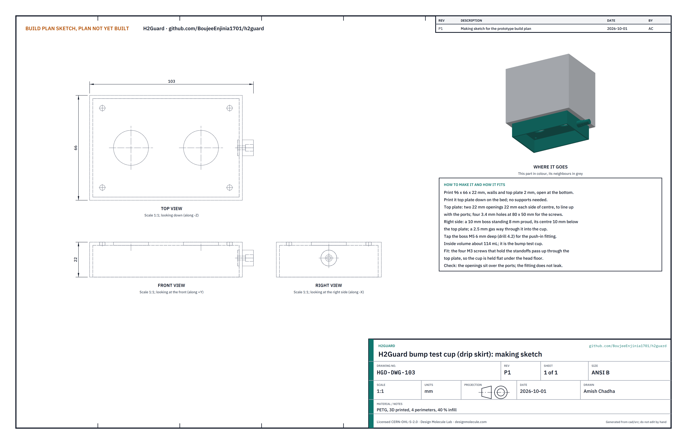

*Figure 4. Bump test cup making sketch (HGD-DWG-103).*

**What it is and what it is made from.** The open-bottomed skirt under the head. It keeps drips off the ports and, during a bump test, holds the test gas round them. PETG, printed with four perimeters and 40 % infill.

**How to make it.**

1. Print the cup 96 x 66 x 22 mm, walls and top plate 2 mm, top plate down on the bed; no supports are needed.
2. The print carries two 22 mm openings in the top plate, 22 mm each side of the centre, and four 3.4 mm holes 80 x 50 mm apart. Check them against the head box before going on.
3. On the right side, a boss 10 mm across stands 8 mm proud, its centre 10 mm below the top face, with a 2.5 mm gas way into the cup. Tap the boss M5 6 mm deep (drill 4.2 mm first if the printed hole is undersize).
4. Screw the M5 straight push-in fitting for 4 mm tube into the boss with thread sealant tape.

**How it fits the parts next to it.**

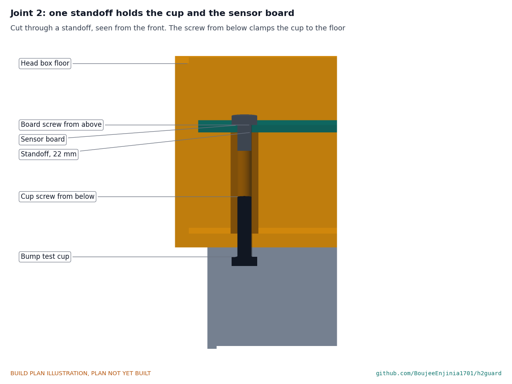

*Figure 5. Cut through a standoff. An M3 screw from inside the cup passes up through the top plate and the head floor into the standoff; the board screw goes into its other end.*

The top plate sits flat against the underside of the head floor with its openings under the ports. Four M3 screws, heads inside the cup, go up through the plate and the floor into four 22 mm M3 female standoffs standing on the inside of the floor. The cup holds about 114 mL.

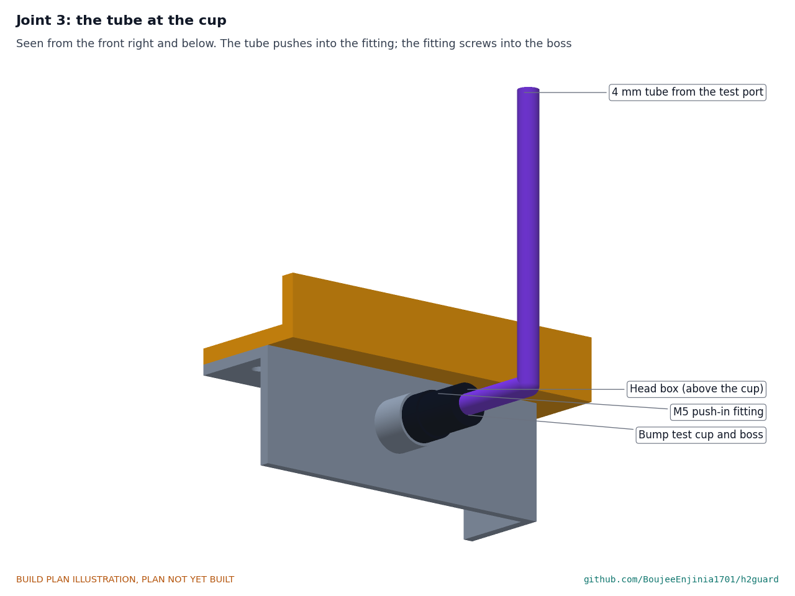

*Figure 6. The 4 mm tube pushes into the fitting on the cup's boss.*

**Check before moving on.** Blow gently through a length of 4 mm tube pushed into the fitting: air comes out of the cup, and the fitting does not leak round its thread.

### 3.3 Sensor board with both sensors

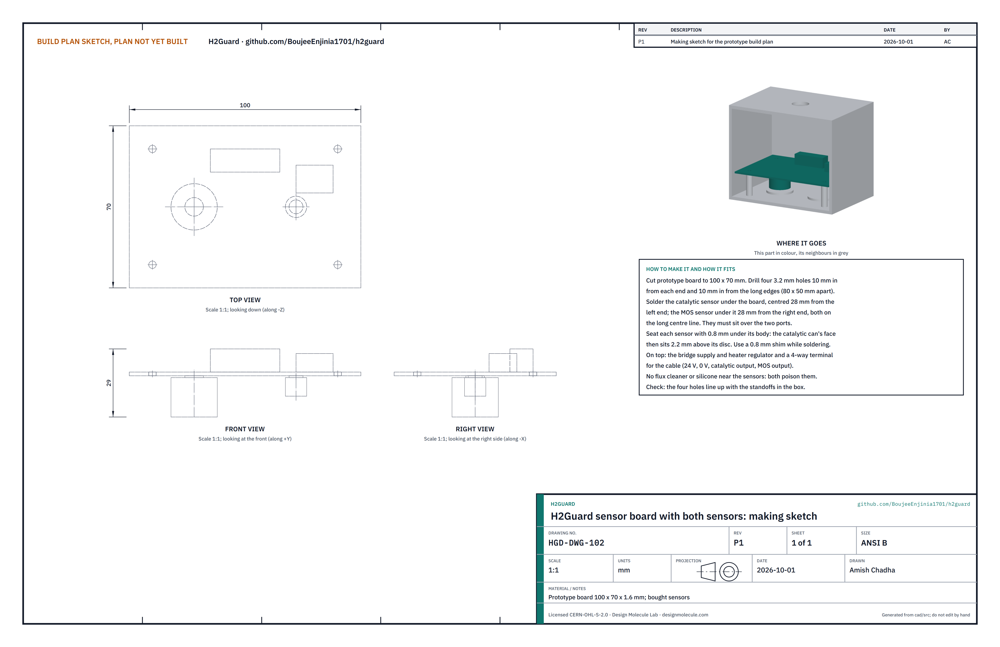

*Figure 7. Sensor board making sketch (HGD-DWG-102).*

**What it is and what it is made from.** A small board that carries the catalytic sensor and the metal oxide sensor under it, over the two ports, and their supply and output parts on top. Prototype board 100 x 70 x 1.6 mm, with the two bought sensors.

**How to make it.**

1. Cut prototype board to 100 x 70 mm. Drill four 3.2 mm holes 10 mm in from each end and 10 mm in from the long edges (80 x 50 mm apart), to match the standoffs.
2. Solder the catalytic sensor under the board on the long centre line, centred 28 mm from the left end; solder the metal oxide sensor under the board on the same line, 28 mm from the right end. They must sit over the left and right ports.
3. Seat each sensor 0.8 mm under the board, using a 0.8 mm shim while soldering. The catalytic sensor's face then sits 2.2 mm above its disc, which keeps the gas delay through the disc to about 1.5 s.
4. On top, build the bridge supply for the catalytic sensor, the heater supply and load resistor for the metal oxide sensor, and a 4-way screw terminal for the cable (24 V, 0 V, catalytic output, metal oxide output), following each sensor maker's application note.
5. Do not use flux cleaner, silicone or solvent near the sensors.

**How it fits the parts next to it.** The board stands on the four standoffs (Figure 5) and is held by four M3 screws from above. It goes in through the open front of the head box before the lid is fitted. The cable comes in through the gland in the top of the box to the 4-way terminal.

**Check before moving on.** With the board on its standoffs, each sensor sits centred over its port and the catalytic sensor's face is 2 to 2.5 mm above its disc (measure with feeler gauges through the open front).

### 3.4 Controller box, drilled

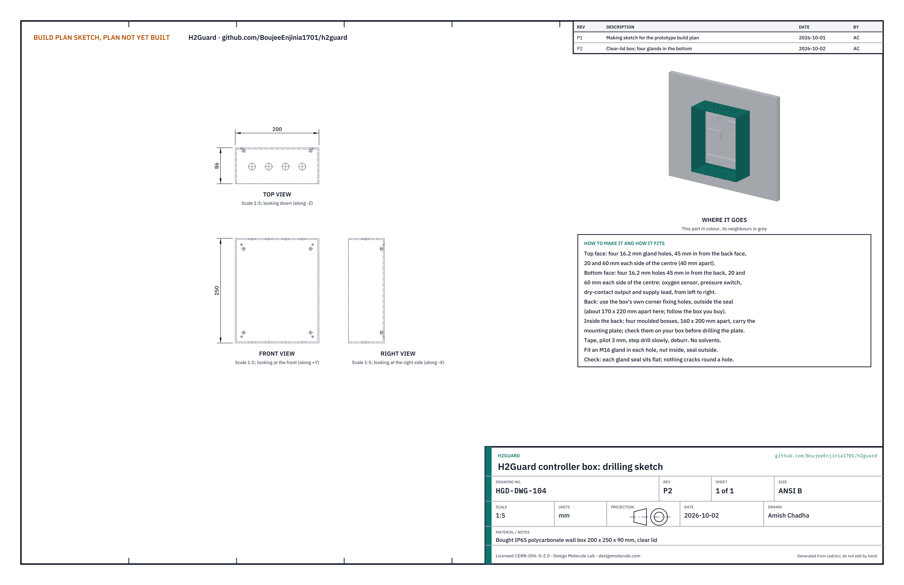

*Figure 8. Controller box drilling sketch (HGD-DWG-104).*

**What it is and what it is made from.** The wall box that holds the electronics. A bought IP65 polycarbonate box 200 wide, 250 tall and 90 deep with its lid on the front, four moulded bosses inside the back and fixing holes at the back corners outside the seal.

**How to make it.**

1. Tape the top and bottom faces and mark the holes.
2. Top: four 16.2 mm holes 45 mm in from the back face, 20 and 60 mm each side of the centre (40 mm apart), for the cables from the head, fan, valve and beacon.
3. Bottom: one 16.2 mm hole 45 mm in from the back face and 60 mm right of the centre, for the supply lead.
4. Pilot drill 3 mm, open with a step drill slowly, deburr. No solvents: polycarbonate crazes.
5. Fit an M16 cable gland in each hole, seal outside, nut inside.
6. Measure the four bosses inside the back (the model assumes 160 mm apart across and 200 mm apart up and down) and note the result for the mounting plate.

**How it fits the parts next to it.** The back sits flat on the wall, top 1,475 mm above the floor (1,025 mm below the ceiling), on four screws with wall plugs through the corner fixing holes. The mounting plate sits on the bosses inside (Figure 10) and the lid closes the front (section 3.6).

**Check before moving on.** Every gland seal sits flat and no crack runs from any hole under a bright lamp.

### 3.5 Controller mounting plate and modules

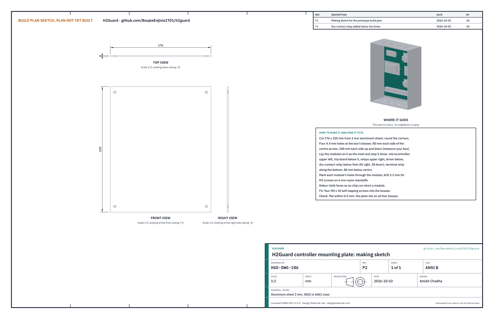

*Figure 9. Controller mounting plate making sketch (HGD-DWG-106).*

**What it is and what it is made from.** The flat plate inside the controller box that carries the bought modules, the hand-built trip board and the terminal strip. Aluminium sheet 2 mm, 5052 or 6061 class, 176 x 220 mm.

**How to make it.**

1. Cut the plate to 176 x 220 mm and round the corners to about 3 mm.
2. Drill four 4.4 mm holes at the boss positions you measured (the model has them 80 mm each side of the centre across and 100 mm each side up and down).
3. Lay out the modules on the front face as Figure 10 shows: microcontroller module upper left, trip board below it, relay module upper right, valve and alarm driver below it, terminal strip along the bottom, 80 mm below the centre.
4. Mark each module's mounting holes through the module, drill 3.2 mm, and fit each module on M3 screws with 6 mm nylon standoffs. Fit the terminal strip directly to the plate.
5. Deburr both faces so no chip can short a module.
6. Wire the modules as Figure 11 shows (section 3.5.1).

**How it fits the parts next to it.**

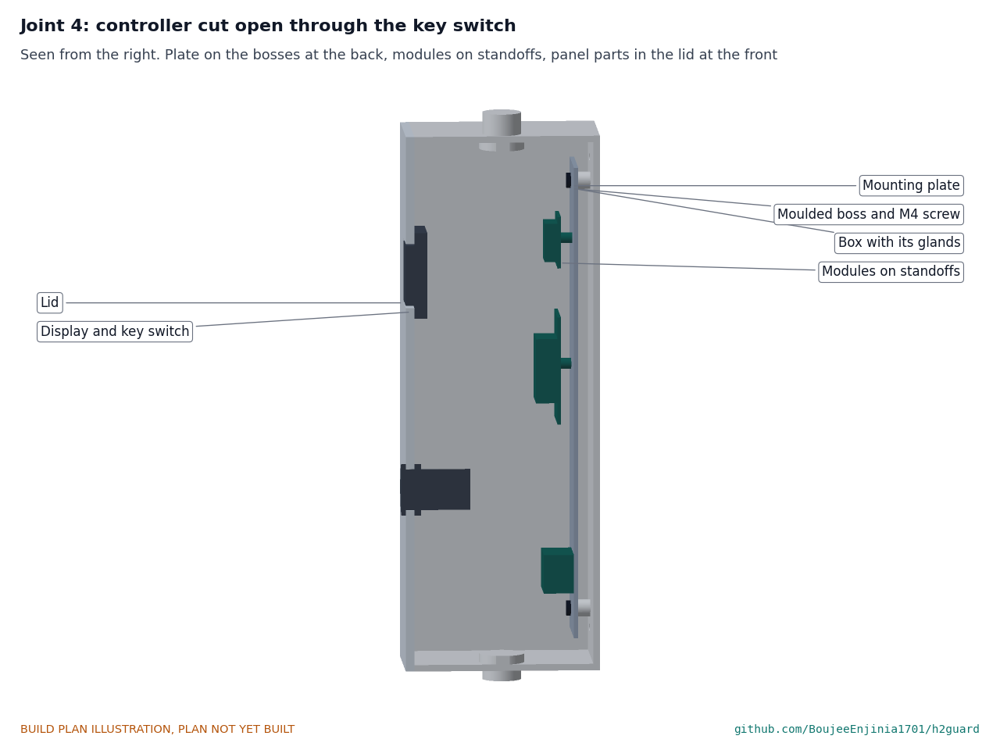

*Figure 10. The plate sits on the four moulded bosses at the back of the box; the modules stand 6 mm off it; the display and key switch are in the lid at the front, well clear of the modules.*

The plate lies flat on the four bosses, held by four M4 x 10 self-tapping screws. Its front face is 9 mm in front of the inside of the back wall, and the deepest module stands about 23 mm in front of the plate, leaving about 25 mm to the back of the key switch in the lid.

**Check before moving on.** The plate is flat within 0.5 mm and sits on all four bosses without rocking.

#### 3.5.1 Wiring

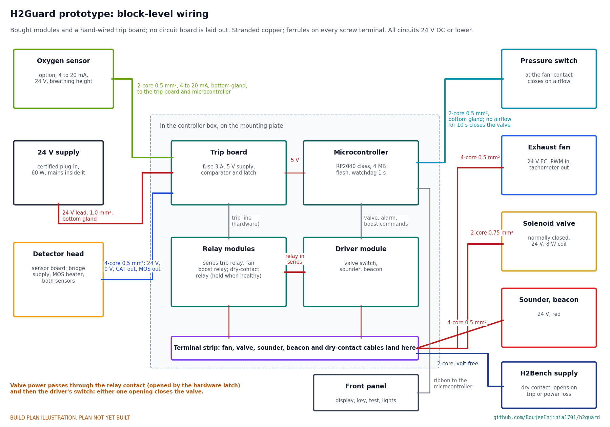

*Figure 11. Block-level wiring with wire sizes. No circuit board is laid out at this stage; bought modules and a hand-wired trip board stand in for the controller board.*

The controller board in the bill of materials is a custom board, which is TRL 4 work. For this prototype, buy or build these:

*Table 2. Modules that stand in for the controller board.*

| Module | What to buy or build |
| --- | --- |
| Microcontroller | RP2040-class module with 4 MB of flash or more and a hardware watchdog |
| Trip board | Hand-wired on prototype board: input fuse about 3 A, 5 V supply from 24 V, the catalytic sensor input, a window comparator that trips above the 25 % LFL level or when the input reads open or shorted, and a latch that only the key resets |
| Relay module | Two relays with 24 V coils: the series trip relay, opened by the latch, and the fan boost relay |
| Driver module | Low-side switches for the valve coil (with a Zener clamp for fast closing), the sounder and the beacon, driven by the microcontroller |
| Terminal strip | 5.08 mm pitch screw terminals for every field cable |

Wire it like this, with stranded copper and a ferrule on every screw terminal:

1. Supply lead from the 24 V unit through the bottom gland to the trip board's fused input: 1.0 mm² (17 AWG).
2. Trip board 5 V output to the microcontroller module: 0.5 mm² (20 AWG).
3. Head cable, 4-core 0.5 mm², through a top gland to the trip board: 24 V, 0 V, catalytic output, metal oxide output.
4. Valve coil supply from the terminal strip through the series trip relay contact and then the driver's valve switch: 0.75 mm² (18 AWG). Either one opening closes the valve.
5. Fan cable, 4-core 0.5 mm², from the terminal strip: 24 V, 0 V, speed signal and tachometer.
6. Sounder and beacon cable, 4-core 0.5 mm², from the terminal strip.
7. Front panel parts to the microcontroller with a short ribbon cable, 0.14 mm².

**Check before moving on.** Every wire continues end to end; with the supply unplugged, no 24 V terminal reads short to 0 V; every wire is labelled at both ends.

### 3.6 Controller lid with the front panel

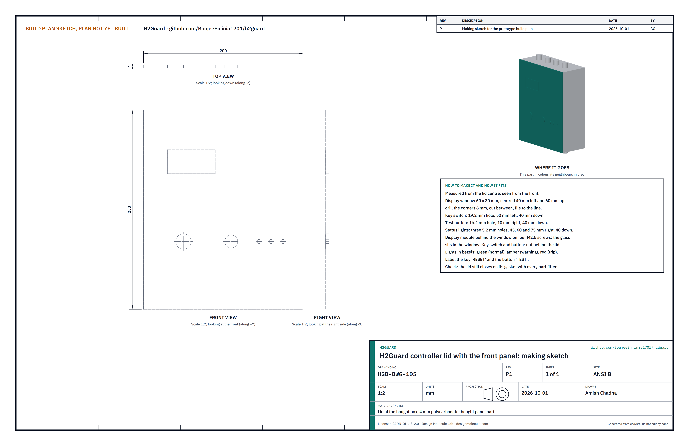

*Figure 12. Controller lid making sketch (HGD-DWG-105).*

**What it is and what it is made from.** The box's own 4 mm polycarbonate lid, cut to take the display, the key-switch reset, the test button and three status lights.

**How to make it.** All positions are from the lid centre, seen from the front.

1. Display window 60 x 30 mm, centred 40 mm left and 60 mm up: drill a 6 mm hole in each corner, cut between them and file to the line.
2. Key switch: 19.2 mm hole, 50 mm left and 40 mm down.
3. Test button: 16.2 mm hole, 10 mm right and 40 mm down.
4. Status lights: three 5.2 mm holes, 45, 60 and 75 mm right and 40 mm down.
5. Fit the display module behind the window on four M2.5 screws, the glass in the window. Fit the key switch and button through their holes with their nuts behind the lid, and the lights in bezels: green (normal), amber (warning), red (trip).
6. Label the key RESET and the button TEST.

**How it fits the parts next to it.** The lid closes on the box's gasket with its own captive screws; the panel parts reach about 26 mm into the box, clear of the modules (Figure 10).

**Check before moving on.** The lid closes evenly on its gasket with every part fitted.

### 3.7 Bump test port bracket

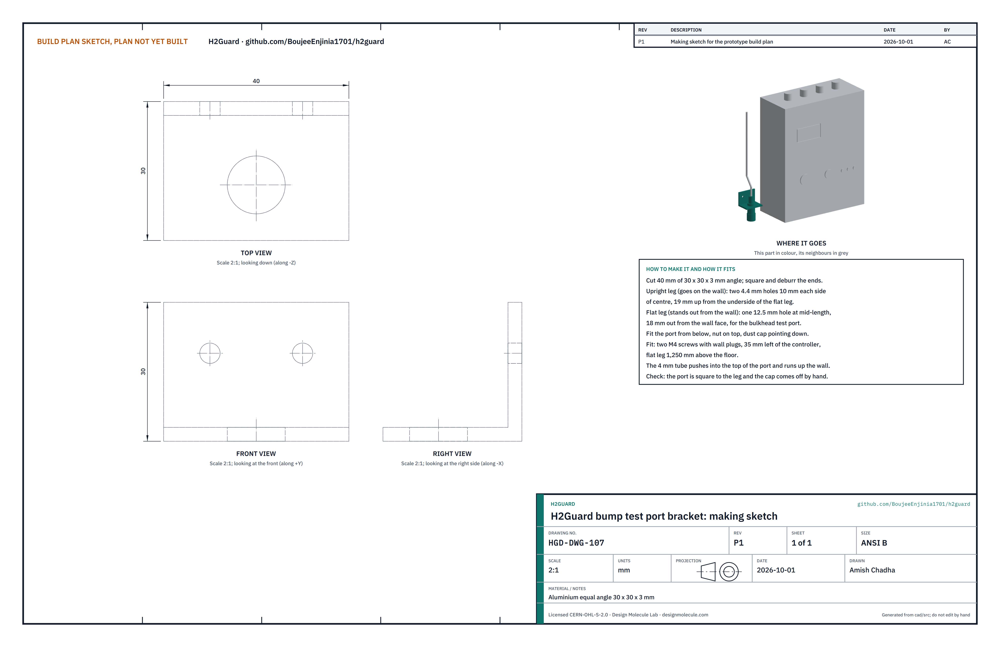

*Figure 13. Test port bracket making sketch (HGD-DWG-107).*

**What it is and what it is made from.** A short angle that holds the capped test port on the wall beside the controller. Aluminium equal angle 30 x 30 x 3 mm, 40 mm long.

**How to make it.**

1. Cut 40 mm of angle; square and deburr the ends.
2. Upright leg (goes on the wall): two 4.4 mm holes 10 mm each side of the centre, 19 mm up from the underside of the flat leg.
3. Flat leg (stands out from the wall): one 12.5 mm hole at mid-length, 18 mm out from the wall face.
4. Fit the bulkhead test port up through the flat leg, nut on top, dust cap underneath.

**How it fits the parts next to it.**

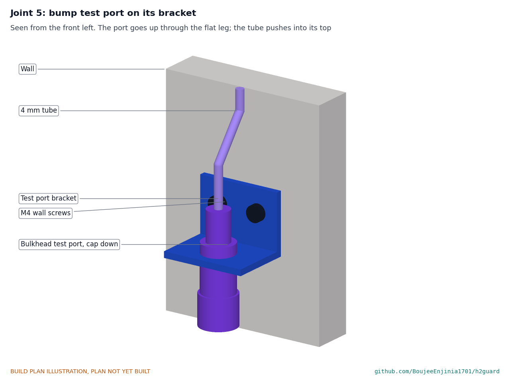

*Figure 14. The port goes up through the flat leg; the tube pushes into its top.*

The upright leg sits flat on the wall 35 mm left of the controller, with the flat leg 1,250 mm above the floor, on two M4 screws with wall plugs. Test gas connects to the port from below; the 4 mm tube leaves its top and runs up the wall.

**Check before moving on.** The port is square to the leg and the dust cap comes off by hand.

### 3.8 Fan plate

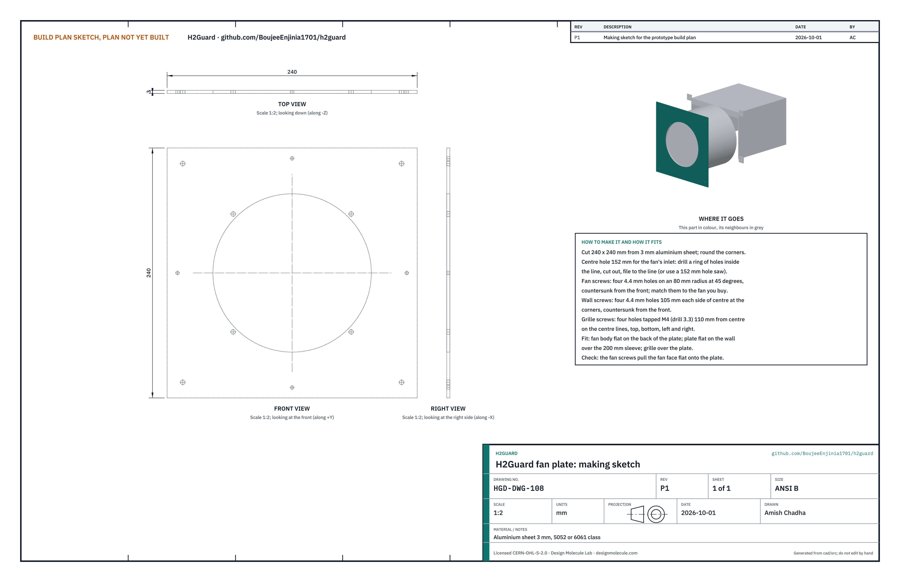

*Figure 15. Fan plate making sketch (HGD-DWG-108).*

**What it is and what it is made from.** A square plate on the inside wall face that holds the exhaust fan in its wall sleeve and carries the inside grille. Aluminium sheet 3 mm, 5052 or 6061 class, 240 x 240 mm.

**How to make it.**

1. Cut the plate to 240 x 240 mm and round the corners.
2. Cut a 152 mm centre hole for the fan's inlet: drill a ring of holes just inside the line, cut out and file to the line, or use a 152 mm hole saw.
3. Fan screws: four 4.4 mm holes on an 80 mm radius at 45° to the centre lines, countersunk from the front. Match them to the fixing holes in the inlet face of the fan you buy.
4. Wall screws: four 4.4 mm holes 105 mm each side of the centre (near the corners), countersunk from the front.
5. Grille screws: four holes tapped M4 (drill 3.3 mm), 110 mm from the centre on the centre lines (top, bottom, left and right).

**How it fits the parts next to it.**

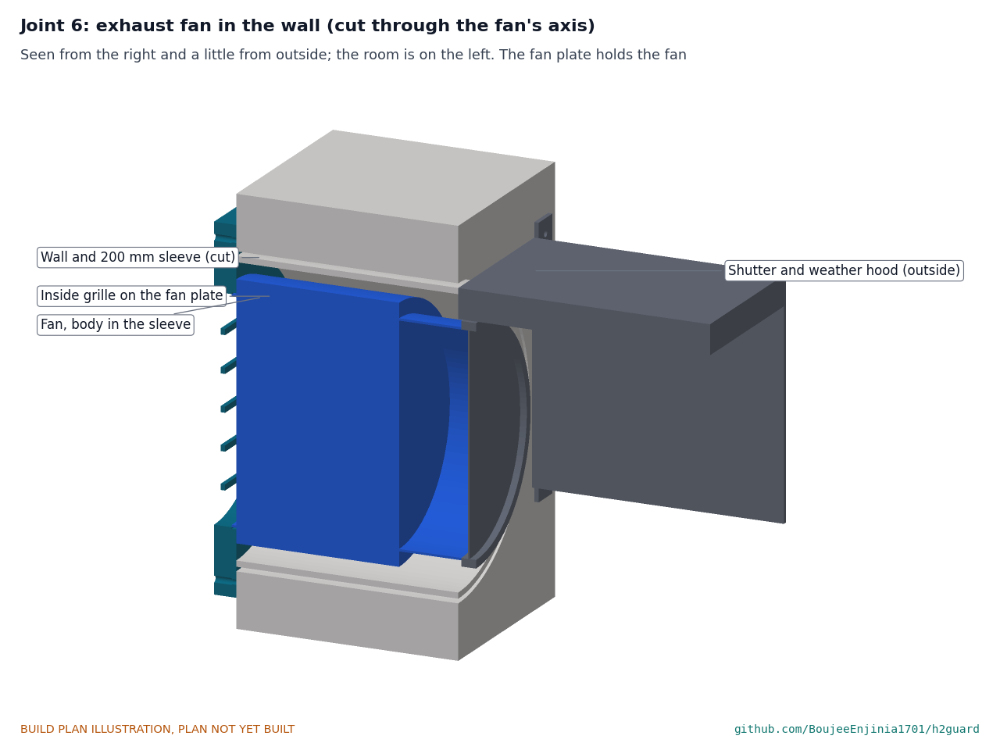

*Figure 16. Cut through the fan's axis. The fan body sits in the 200 mm sleeve, its inlet face flat on the back of the plate; the grille covers the plate; the shutter and hood are outside.*

The fan's inlet face sits flat on the back of the plate, held by four M4 countersunk screws from the front. The plate sits flat on the inside wall face over the 200 mm sleeve, centred 2,300 mm above the floor, on four countersunk screws with wall plugs. The inside grille screws to the plate's tapped holes. The fan body stands 11 mm clear of the sleeve all round.

**Check before moving on.** The four fan screws pull the fan face flat onto the plate, and the fan turns freely by hand.

### 3.9 Valve bracket

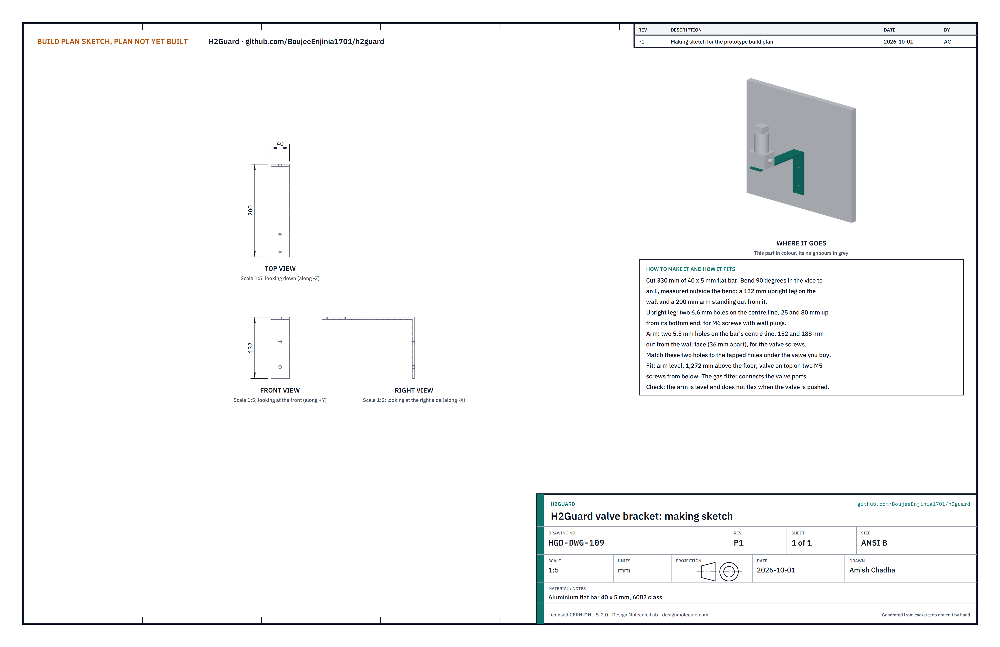

*Figure 17. Valve bracket making sketch (HGD-DWG-109).*

**What it is and what it is made from.** An L-shaped bracket that holds the solenoid valve off the wall, in line with the supply. Aluminium flat bar 40 x 5 mm, 6082 class.

**How to make it.**

1. Cut 330 mm of bar. Bend it 90° in the vice to an L, measured outside the bend: a 132 mm leg for the wall and a 200 mm arm. Bend slowly round a radiused jaw so the outside of the bend does not crack.
2. Wall leg: two 6.6 mm holes on the centre line, 25 and 80 mm up from its bottom end.
3. Arm: two 5.5 mm holes on the centre line, 152 and 188 mm out from the wall face (36 mm apart). Match them to the tapped holes under the valve you buy.

**How it fits the parts next to it.**

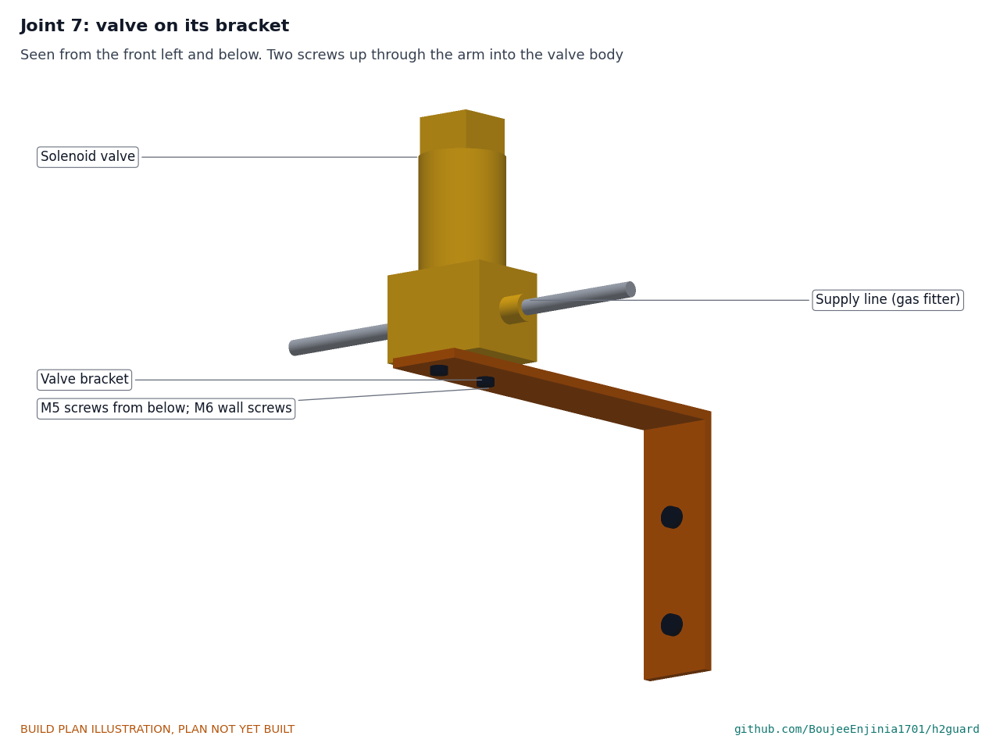

*Figure 18. Two M5 screws come up through the arm into the valve body; the gas fitter connects the supply to the valve's ports.*

The wall leg sits flat on the wall on two M6 screws with plugs; the arm is level, its top 1,277 mm above the floor. The valve sits on the arm, held by two M5 screws from below. The supply line connects to the valve's two ports, downstream of the regulator and flow restrictor.

**Check before moving on.** The arm is level and does not flex when you press on the valve.

### 3.10 Bought components

Buy to specification, not brand. Line numbers are those of the bill of materials.

- **Head box (line 1).** ABS or polycarbonate, 110 x 80 x 90 mm, lid on a 110 x 90 face, with an M16 cable gland. Drill as section 3.1.
- **Catalytic and metal oxide sensors (lines 2 and 3).** A catalytic sensor reading 0 to 100 % LFL of hydrogen with a can about 20 mm across, and a metal oxide hydrogen sensor for about 30 to 3,000 ppm, each with its maker's datasheet and application note.
- **Arrestor discs (line 4).** Two sintered stainless steel discs 25 mm across and 2 mm thick, pores 50 µm or finer; two-part epoxy.
- **Controller box (line 5).** IP65 polycarbonate, 200 x 250 x 90 mm, lid on the front, four moulded bosses inside the back, corner fixing holes outside the seal; five M16 cable glands.
- **Controller modules (line 6) and front panel parts (line 7).** As Table 2; a small display module, a key switch for a 19 mm hole, a push button for a 16 mm hole and three 5 mm lights in bezels.
- **24 V supply (line 8).** Certified plug-in or desktop unit, 24 V, 2.5 A (60 W).
- **Exhaust fan (line 9).** 150 mm mixed-flow EC duct fan, 24 V, about 450 m³/h in free air and 200 Pa at shut-off, speed input and tachometer output, body about 170 mm across with fixing holes in its inlet face; a 240 mm square inside grille; a 200 mm wall sleeve 150 mm long; a backdraft shutter for the 150 mm outlet; a weather hood with fixing tabs.
- **Make-up air grille (line 10).** Wall grille 300 x 160 mm with insect mesh and about 50 % free area.
- **Solenoid valve (line 11).** Two-way, normally closed, direct acting, 1/4 in, brass body with FKM seals and two tapped mounting holes underneath, 24 V DC coil of about 8 W, 0 to 10 bar.
- **Sounder and beacon (line 12).** 24 V DC, about 90 dB at 1 m, red flashing beacon.
- **Cable (line 13).** Four-core 0.5 mm² for the head, fan and beacon; two-core 0.75 mm² for the valve; about 15 m in all, with surface conduit.
- **Fixings (line 14).** Four M3 x 22 mm female standoffs; M3 screws; 6 mm nylon standoffs; M2.5, M4, M5 and M6 screws; wall plugs; ferrules, heat-shrink and labels.
- **Test port, tube and fittings (line 15).** Bulkhead push-fit test port for 4 mm tube with a 12 mm thread and dust cap; about 3 m of 4 mm PTFE or nylon tube; an M5 straight push-in fitting; seven saddle clips.
- **Bar and sheet (line 16).** 2 mm and 3 mm aluminium sheet, 30 x 30 x 3 mm angle and 40 x 5 mm flat bar for the made parts.

## 4. Putting it together

In each picture the parts already fitted are grey and the part being fitted is in colour, with an arrow showing the way it goes in. Steps 1 to 3, 5, 6 and 8 are bench work; the rest is done in the room.

### Step 1: arrestor discs into the head

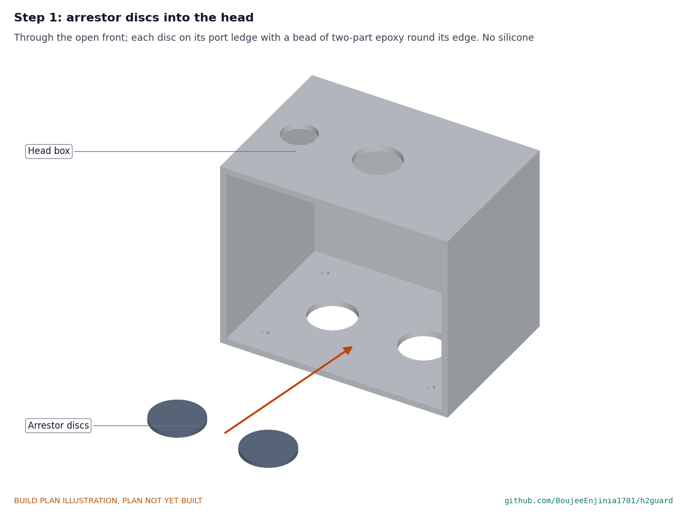

Through the open front, lay each disc on its port ledge and run a bead of two-part epoxy round its edge. Let it cure fully, with the box open to the air, before the sensors go in.

### Step 2: standoffs and bump test cup

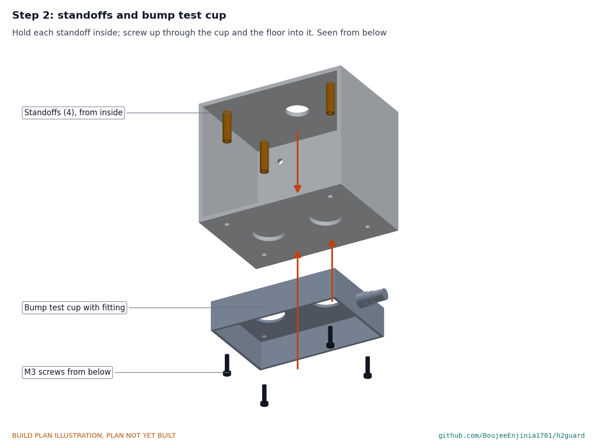

Hold each standoff on the inside of the floor and screw an M3 screw up through the cup's top plate and the floor into it. Check the cup's openings sit under the ports before tightening.

### Step 3: sensor board and cable gland

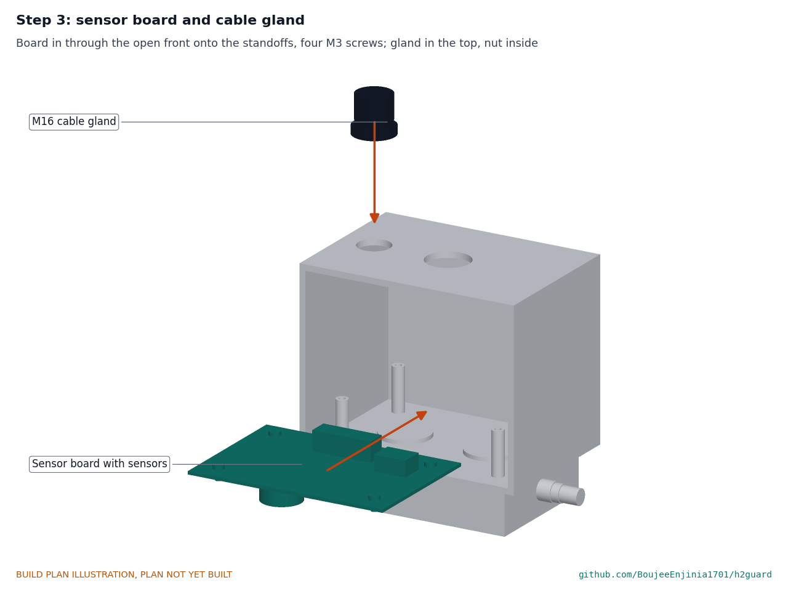

Slide the board in through the open front onto the standoffs and fit four M3 screws. Fit the cable gland in the top, nut inside.

### Step 4: detector head onto the wall above the leak point

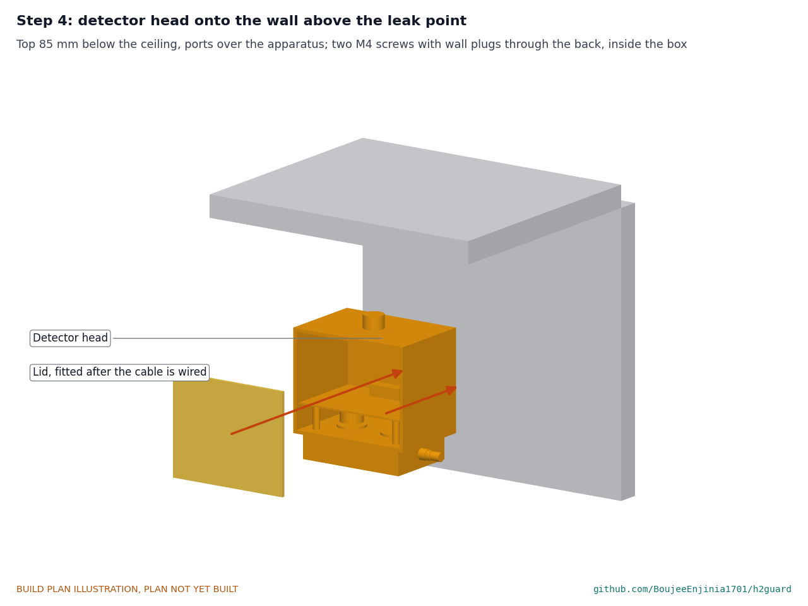

Mark the head's position on the back wall directly above the apparatus, with its top 85 mm below the ceiling. Two M4 screws with wall plugs through the back of the box, from inside. The lid goes on after the cable is wired (step 15).

### Step 5: glands and mounting plate into the controller box

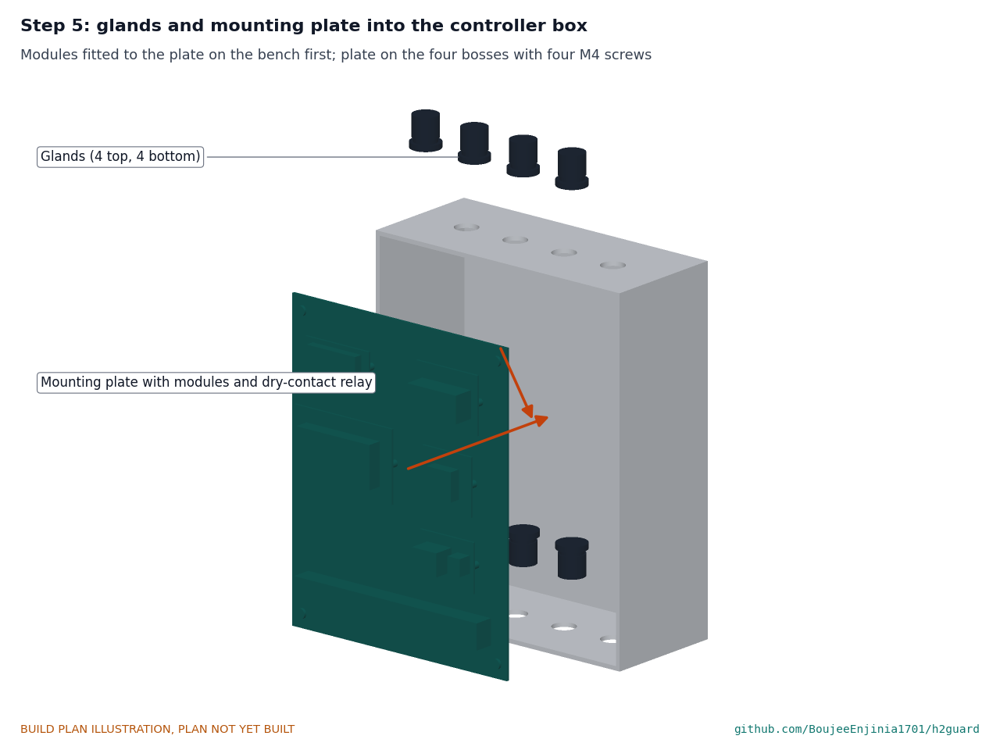

Fit the five glands. With the modules already on the plate and wired, set the plate on the bosses and fit four M4 self-tapping screws.

### Step 6: front panel parts into the lid

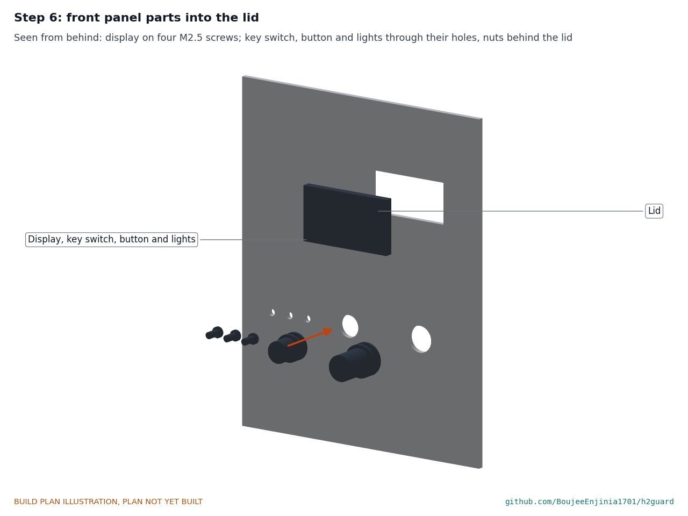

From behind the lid: the display on four M2.5 screws; the key switch, test button and lights through their holes, nuts behind the lid. Plug the ribbon cable into the display.

### Step 7: controller and test port bracket onto the wall

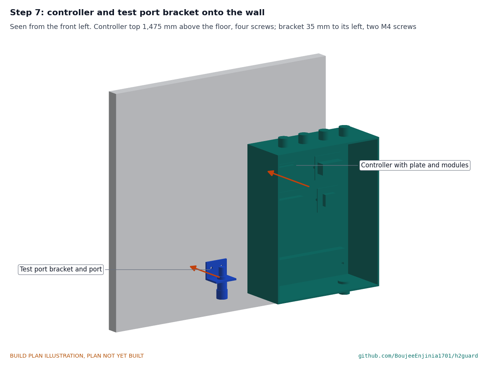

Controller box on the wall with its top 1,475 mm above the floor, four screws with plugs through the corner holes. Test port bracket 35 mm to its left, flat leg 1,250 mm up, two M4 screws with plugs. **Hold point:** the controller top is at least 1,000 mm below the ceiling.

### Step 8: fan onto the fan plate

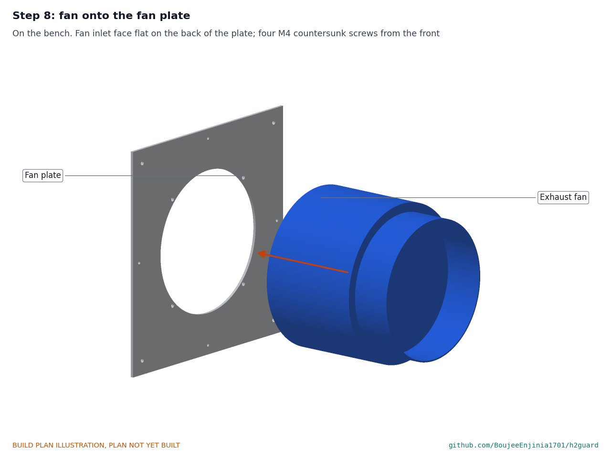

On the bench. The fan's inlet face flat on the back of the plate, four M4 countersunk screws from the front.

### Step 9: sleeve and fan into the wall

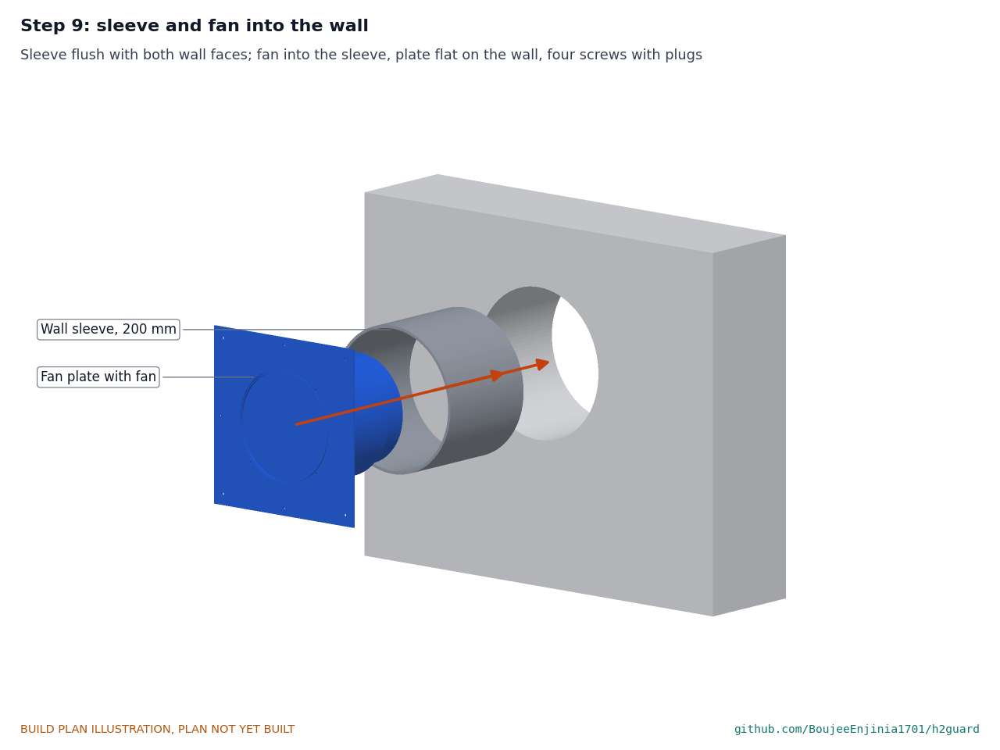

The builder's 206 mm opening is centred 2,300 mm above the floor. Push the 200 mm sleeve in flush with both wall faces. Slide the fan body into the sleeve and fix the plate flat on the wall with four countersunk screws and plugs.

### Step 10: grille, shutter and weather hood

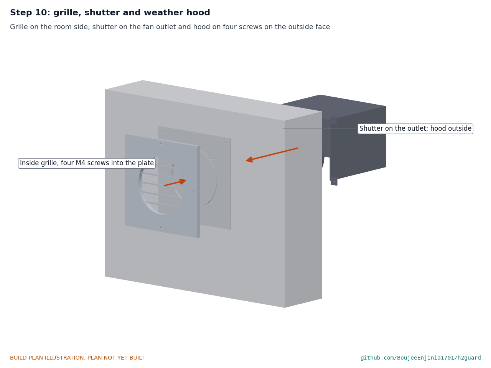

Inside grille onto the plate with four M4 screws. Outside, push the backdraft shutter onto the fan's outlet spigot, flap hanging closed, then fix the weather hood over it, open side down, with four screws and plugs.

### Step 11: make-up air grille

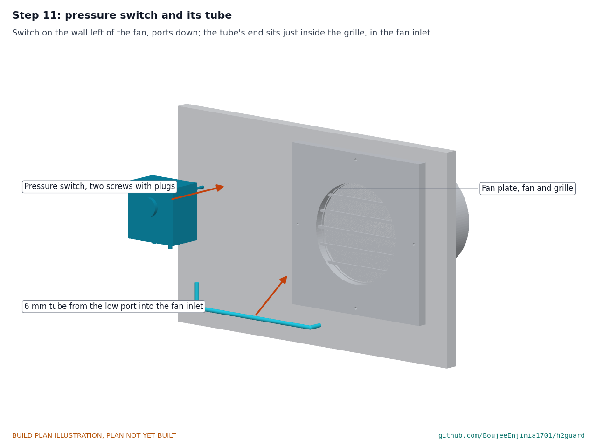

Low on the side wall opposite the fan, over the builder's opening, centred 200 mm above the floor, mesh fitted; four screws with plugs.

### Step 12: valve bracket and valve

Bracket on the wall with the arm level and its top 1,277 mm above the floor, two M6 screws with plugs. Valve on the arm, two M5 screws from below. **Hold point:** the gas fitter connects the valve into the supply after the regulator and flow restrictor, and leak tests the joints with inert gas; no hydrogen is connected yet.

### Step 13: sounder, beacon and power supply

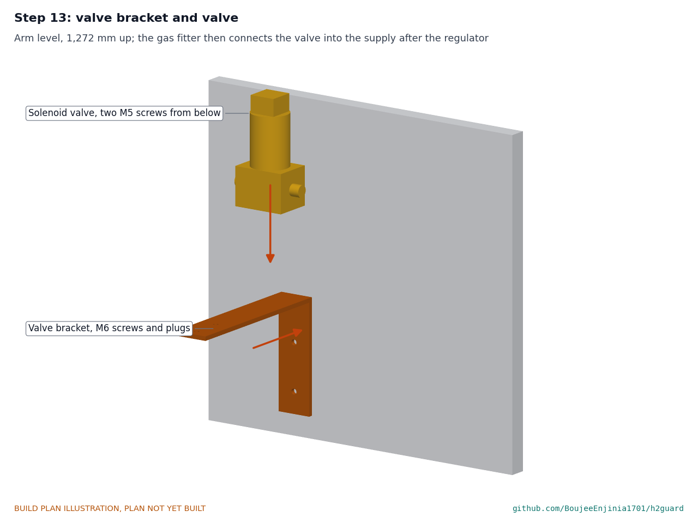

Sounder and beacon by the door with its top 450 mm below the ceiling, two screws with plugs. Stand the 24 V supply on the floor by the outlet; do not plug it in yet.

### Step 14: bump test tube and clips

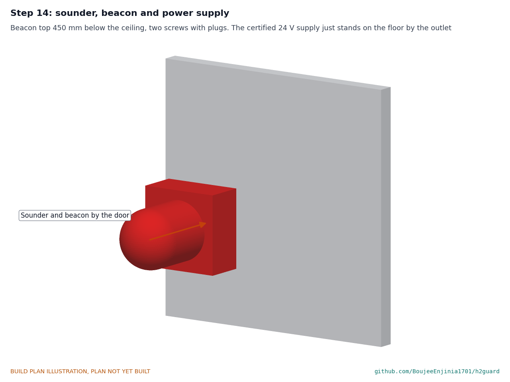

Push the 4 mm tube into the top of the test port, run it up the wall beside the controller, along the wall under the ceiling and down beside the head into the cup's fitting. Seven saddle clips hold it; keep it clear of the fan grille and away from the cables.

### Step 15: wire up and close the lids

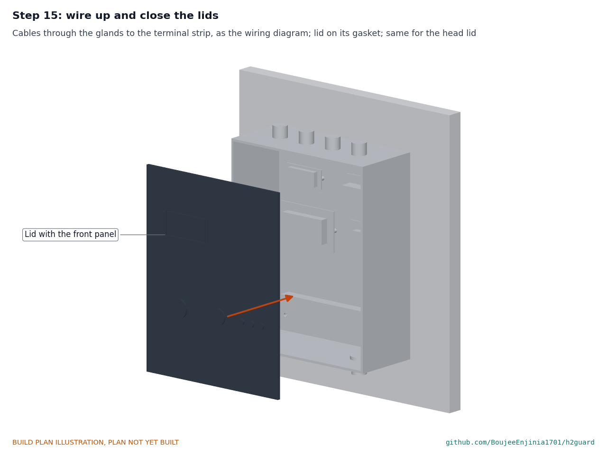

Run the cables in surface conduit and through the glands to the terminal strip and the head's terminal, as Figure 11. Close the controller lid and the head lid on their gaskets. **Hold point:** safety stops S1 and S2 in section 6.

## 5. First checks

These are the checks a TRL 4 test report would record; this plan only lists them. Requirement numbers are those of HGD-REQ-001.

*Table 3. First checks.*

| Check | Requirement | How | Pass when |
| --- | --- | --- | --- |
| Mounting heights | R1, R15 | Tape measure from the ceiling | Head ports 175 mm below the ceiling, give or take 10 mm; controller top at least 1,000 mm below |
| Head over the leak point | R1 | Plumb line from the head's ports to the apparatus | The ports are over the apparatus's likely leak point (the offset limit is set by test at TRL 4) |
| Power draw | R11 | Meter in the 24 V lead, normal state and with the test button held | Under 60 W at the peak (48.3 W estimated) |
| Fail-safe on power loss | R5 | Unplug the 24 V lead with the valve open (inert gas in the line) | The valve closes; flow stops |
| Hardware trip | R6 | With the microcontroller held in reset, feed the trip board's input a voltage equal to 25 % LFL | The series relay opens and the valve closes; only the key resets it |
| Sensor fault | R5 | Open and then short the catalytic sensor input | Valve closed within 2 s; fault shown |
| Fan stop | R5, R7 | Hold the fan still (supply off at the fan) | Valve closed within 2 s of the 10 s tachometer timeout |
| Ventilation | R7 | Vane anemometer across the inside grille at continuous and boost speed | At least 150 m³/h continuous and 300 m³/h on boost |
| Alarm | R10 | Sound meter at 1 m from the sounder | 85 dB(A) or more; beacon visible from the door |
| Bump test | R12 | Certified 1 % hydrogen in air at 1 L/min into the test port (after stop S4) | The catalytic reading rises and the system trips within 120 s |
| Self-test | R12 | Press TEST | Sounder, beacon, fan boost and valve close all run |

## 6. Safety stops

Stop at each point. Carry on only when everything listed is true.

- **S1. Before the 24 V supply is plugged in.** The supply is a certified unit with an undamaged lead. With it unplugged, no 24 V terminal reads short to 0 V. The valve coil wiring passes through the series relay and the driver switch. Every gland is tight and every lid closed.
- **S2. Before the sensors are powered.** The epoxy round the discs has cured for its full time with the head open; no silicone, flux cleaner or solvent has been used in or near the head.
- **S3. Before any gas reaches the valve.** A competent gas fitter has connected the valve after the regulator and flow restrictor and leak tested every joint with inert gas. The fault checks of section 5 (power loss, hardware trip, sensor fault, fan stop) all close the valve.
- **S4. Before the first bump test.** The test gas is a certified mixture of no more than 1 % hydrogen in air, in a disposable cylinder with its own regulator set to about 1 L/min. The fan is running. Someone stands by the controller with the key. Expect the system to trip; reset only when the reading is below 10 % LFL.
- **S5. Before hydrogen from the room's supply is turned on.** The hydrogen inventory in the room is within the 300 L limit (1 % of room volume at atmospheric pressure), or a flow restrictor limits a failure to 5 L/min. The bump test has passed that day. The room has a second, certified means of protection wherever codes or insurers require one.
- **S6. Every teaching session.** Bump test before use and after any exposure to silicone or solvent vapour; check by hand that air flows at the inside grille and that the valve closes on TEST. A blocked duct or a leaking valve seat is not detected by the system.

## 7. Tools, skills and workspace

**Tools.** Bench drill or a drill in a stand; drills 2.5 to 12 mm; step drill to 20 mm; 152 mm hole saw (or a jigsaw with a metal blade); countersink; M4 and M5 taps and tap drills; hacksaw; bench vice with soft jaws and a radiused jaw for bending; flat and half-round files; deburring tool; scriber, square, steel rule and calipers; feeler gauges; 3D printer that prints PETG with a bed of at least 100 x 70 mm; soldering iron; ferrule crimper and wire strippers; multimeter; screwdrivers and nut drivers; masonry drill and wall plugs for the room; spirit level; tape measure and plumb line. The fan and make-up air openings need a 206 mm core drill and a builder.

**Skills.** Basic metalwork (marking out, drilling, filing, tapping, bending flat bar), through-hole soldering, crimping, and reading a sensor datasheet and application note. All circuits are 24 V DC or lower; mains appears only inside the certified supply. The gas connection must be made and leak tested by a competent gas fitter.

**Workspace.** A bench about 1.2 x 0.6 m with the metalwork kept apart from the electronics; a ventilated place for the printer; a step ladder with a second person for work at the ceiling.

**Personal protective equipment.** Safety glasses for drilling, cutting and soldering; gloves for cut aluminium; dust mask and hearing protection when drilling masonry; no gloves near a turning drill.

## 8. Where the numbers come from

- Model and constructability checks: `cad/src/model.py` (`python cad/src/model.py --check`, 127 checks); STEP and STL exports in `cad/step/` and `cad/stl/`.
- Pictures: `cad/src/build_plan_media.py`, using `.kit/build_views.py`; written to `docs/05-build-plan/` and `cad/drawings/HGD-DWG-101` to `HGD-DWG-109`.
- General arrangement: `cad/drawings/HGD-DWG-001.pdf`, Rev P4.
- Calculations: `docs/04-calcs/01-sizing.md` (HGD-CAL-001 v0.3) and `docs/04-calcs/sizing.py`; arrestor lag [F1], fan delivery [G3], power [H2], bump test [J1], installation [M1], cost [N1].
- Bill of materials: `bom/bom.csv`.
- Decisions: `docs/decisions/0003-design-for-construction.md` (HGD-DDR-003), with HGD-DDR-001 and HGD-DDR-002.
- Requirements: `docs/03-requirements.md` (HGD-REQ-001 v0.5).
